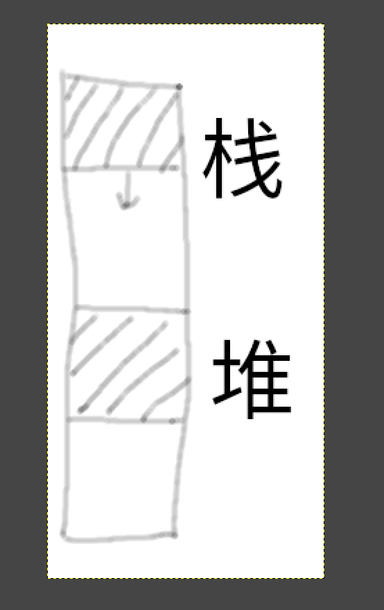

# C语言基础相关问题

## `__ctx`与`__ctx*`

`__ctx`（`char[120]`）类型的变量本来就是一个地址，为什么传参不直接传`__ctx`而是传`__ctx*`？

```C++
void __err_stk_push(__ctx* ctx);
```

解答：

设有变量`__ctx a`或者`char a[120]`：

1. a和&a指向的是同一个地址
2. a的类型是`char*`，&a的类型是`char(*)[120]`，只在指针运算（如`a+=1`）时不同

## `malloc`分配的地址



# Task 3

## 明明输出了testx PASSED，但是却又报错

对应的测试函数运行完之后，检查发现内存中应该清除的上下文没有清除，一般是实现有误。或者把栈帧搞崩了没法return。

善用GDB检查错误在哪里，为什么会出错。

## printf或malloc等函数内发生段错误

Task1有提到过“`system` 内部某些汇编语句对栈的对齐要求很高”，对于这些函数也是一样。GDB看看是不是停在使用xmm寄存器的语句，需要rsp16字节对齐。

## 我不知道如何在try/catch/throw/generator里面判断test是否怎么怎么样

不需要知道。你实现的是基础设施，并不需要知道用户怎么使用。如果你发现了用户的实现有潜在的bug（比如内存泄漏），你也不需要去修正。

# Task 3.3

## 为什么要用malloc申请一段空间当做栈？

如果你这样实现生成器：
主函数创建生成器A，分配A的栈帧在主函数栈帧下面，然后主函数没有启动生成器A而是调用了其他函数，新的栈帧直接破坏了你分配给A的栈帧。
如上文所说，malloc分配的空间在堆里面，可以视作和栈不相关。

本次lab保证生成器内用到的栈帧都不大，你可以放心使用malloc申请一段空间为其所用。

## try与生成器的嵌套

什么是“在外部处理生成器内部未处理的`throw`”？

解答：

假设有生成器a：
```python
def main():
    try{
        a.send(1)
    }
    catch{
        print(error)
    }
```
如果a里面没有try直接throw，程序应该回到主函数被catch住而不是直接爆炸。不然就成了明明try代码块里面发生了异常，却没有catch住，直接爆炸，那还要try来干啥呢。

如果a调用了生成器b，b调用了生成器c，c直接throw，同理。

## 什么叫跳板函数？

不是直接运行生成器对应的函数，而是先进到这个函数，用这个函数去调用需要运行的函数。
好处在于执行“生成器对应的函数”前后都是可控的。

## 如何配置初始上下文？

做完前面的lab，结合lab说明，你应该知道：

1. restore具有修改rip、跳转程序当前正在执行的位置的效果。
2. 假设两个生成器已经跑起来了，你可以随时切换当前正在执行的生成器，并从上次暂停的位置继续运行下去。
3. 构造生成器时，通过伪造“好像生成器已经跑起来了”的状态，这样下次send的时候就可以直接切换过去了。